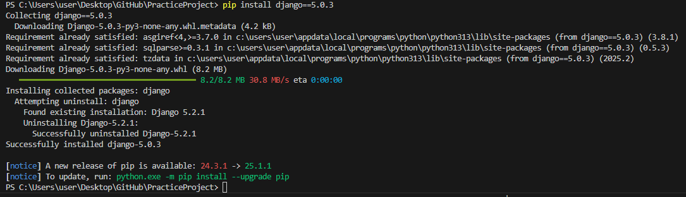
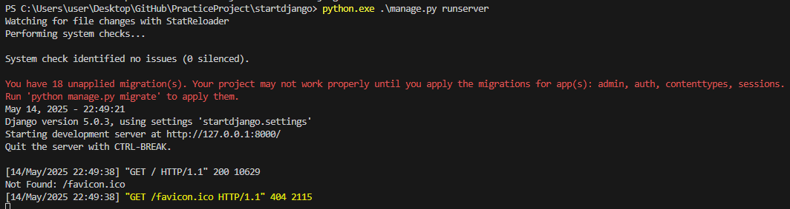
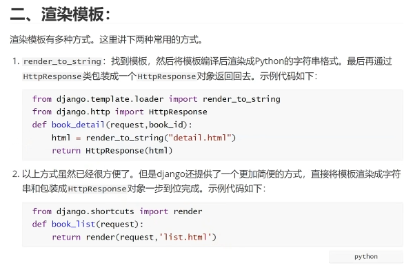
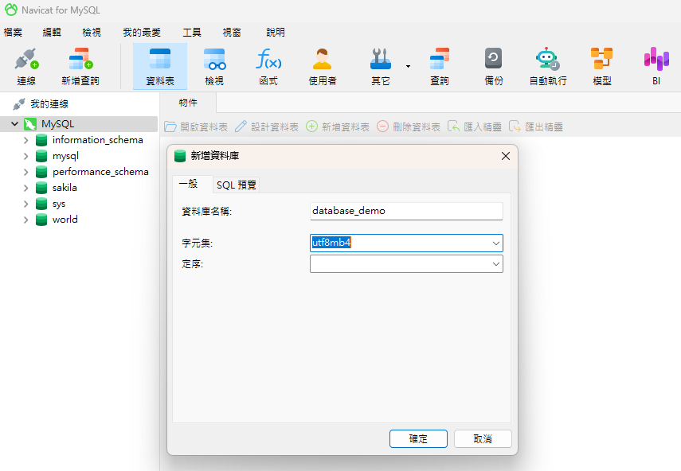
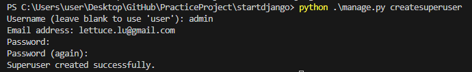
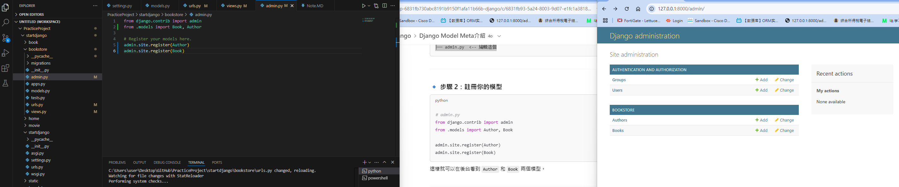

2025/05/14
1. MVC 概念

Model: 和資料庫交互(增、刪、改、查)

View: 生成頁面 html 相關

Controller: 接收請求, 處理業務邏輯

# install django 5.0.3

# 啟動 django 服務
python.exe .\manage.py runserver

# 渲染模板

# 安裝MySQL 8.0
# 安裝 Navicat
# 安裝 pymysql & mysqlclient
PS C:\Users\user\Desktop\GitHub\PracticeProject\startdjango> pip install pymysql
PS C:\Users\user\Desktop\GitHub\PracticeProject\startdjango> pip install mysqlclient
# 新建數據庫

# 設定 setting.py 中的 DATABASES

# 創建後來用戶

# admin 後台註冊 models

