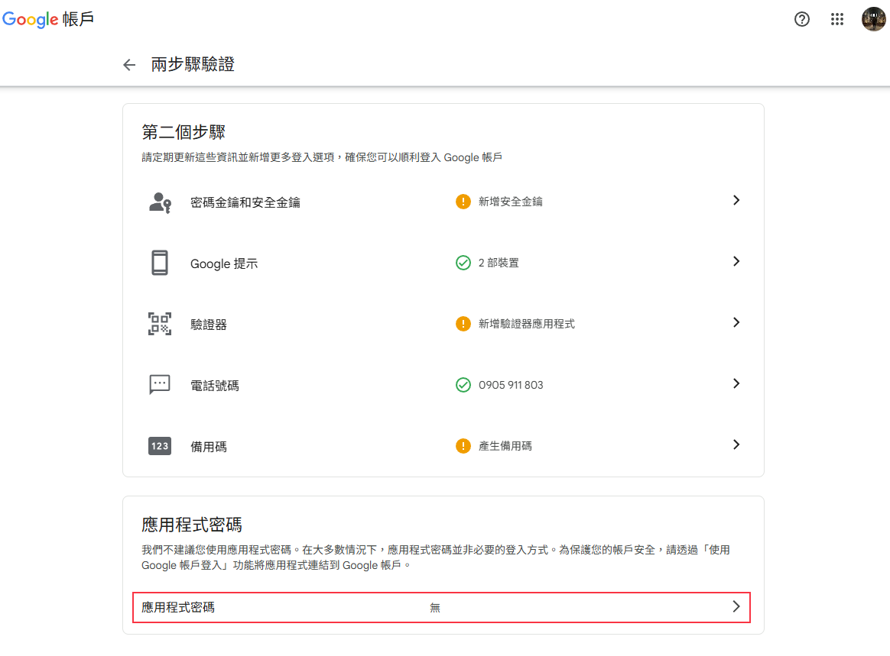
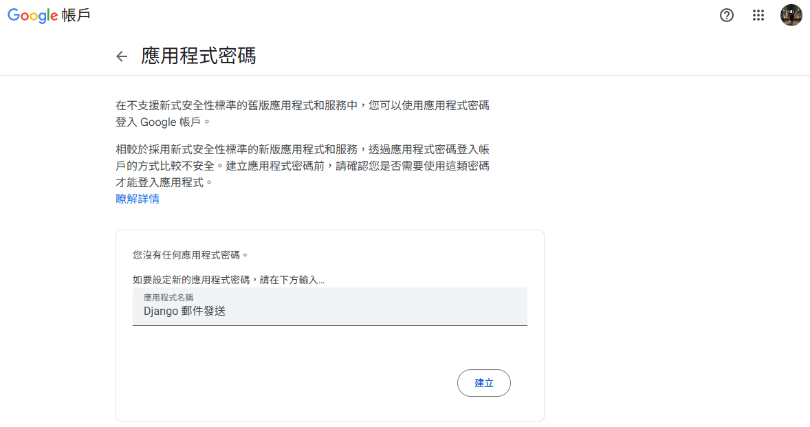

要在 Django 應用程式中利用 Google 郵箱（Gmail）發送郵件，你需要完成幾個步驟：

### 啟用 Gmail 的「兩步驟驗證」

### 生成「應用程式密碼」

###### qsuk jlnj srus nblg ######
### 在 Django 專案中配置郵件設定
在專案中直接設定密碼是很不安全的作法, 因此要使用環境變數的方式進行調用, 因為代碼都是有概率會上傳到 github 的.
1. 安裝 python-dotenv
pip install python-dotenv

2. 在根目錄創建 .env 檔案
.env 檔案(跟 manage.py 同一級目錄)
EMAIL_HOST_USER=你的完整Gmail郵箱地址@gmail.com
EMAIL_HOST_PASSWORD=你的應用程式密碼

3. 將 .env 加入 .gitignore 檔案, 確保它不會被提交到 Git
.gitignore
.env

4. 在 setting.py 中讀取環境變數
from dotenv import load_dotenv

load_dotenv()

EMAIL_BACKEND = 'django.core.mail.backends.smtp.EmailBackend'
EMAIL_HOST = 'smtp.gmail.com'
EMAIL_PORT = 587
EMAIL_USE_TLS = True

### 編寫發送郵件的程式碼